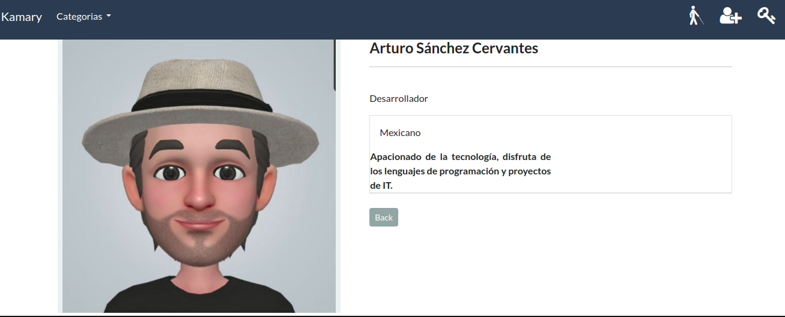
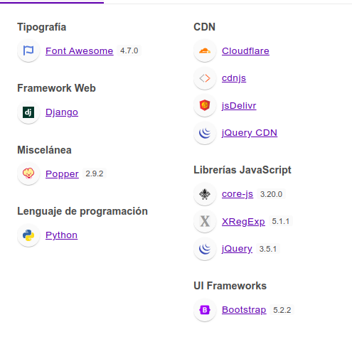

# Proyecto Final Del Curso Python Orientado a la Programación Web
#### Comisión: 60070
#### Alumno: Arturo Sánchez Cervantes

## Nombre del Proyecto
Kamari Tienda

## Versión
1.0

## Descripción del Proyecto
Tienda en línea de Artículos de temporada

Implementa:
- Mensajería de django
- Backend de correo configurada y "harcodeada" - por el momento,¡¡no me jusguen!!. =( -
- Sesion guardada en base de datos.
- Modelo con campo json para guardar info de carrito de compras.
- Formularios Ajax.

Algunas Acciones:
Sólo los usuarios registrados pueden agregar objetos al carrito y sólo los usuarios que pertenecen al staff pueden administrar el inventarío.

Modulos terminados de la tienda:
- Registro y admon. de cuentas
- Carrito de compra
- Registro de Inventarío

Módulos no desarrolados aún:
- La opción de agregar usuaríos al staff no esta desarrollada.
- shipping
- rastreo de artículos
- Pasarela de pagos

## Tecnología Utilizada

también uso: django-crispy-forms==1.14.0 vease archivo [requirements.txt](./requirements.txt)

## Pruebas Realizadas

Resumen de pruebas unitarías en el archivo. [pruebas.md](https://github.com/arthus99/coder-python-final/blob/main/pruebas.md)

## Video Demostración

Vea usted: [kamari](https://youtu.be/1V7AvAR83AE)